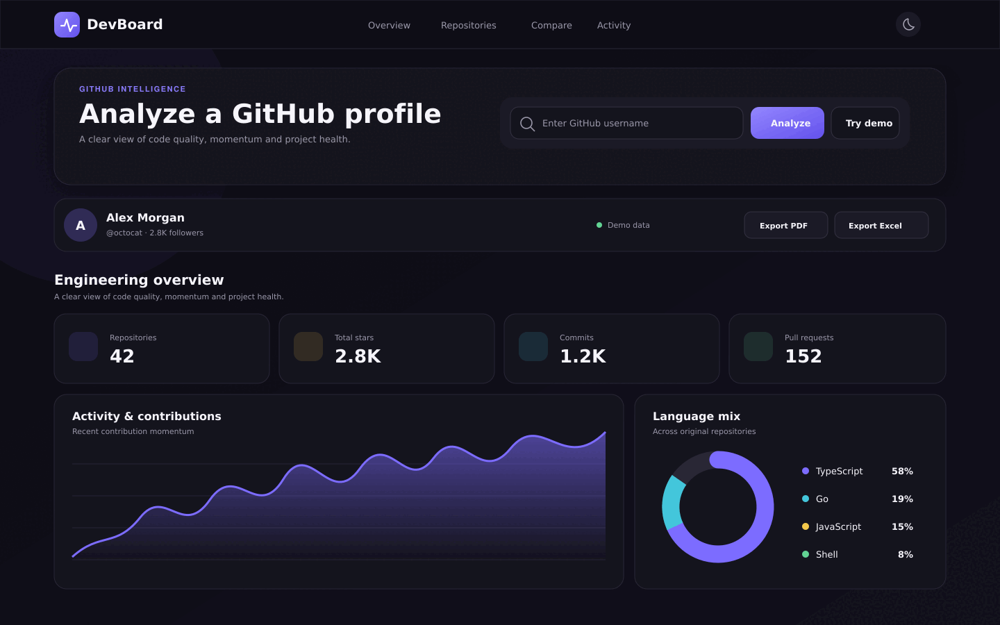
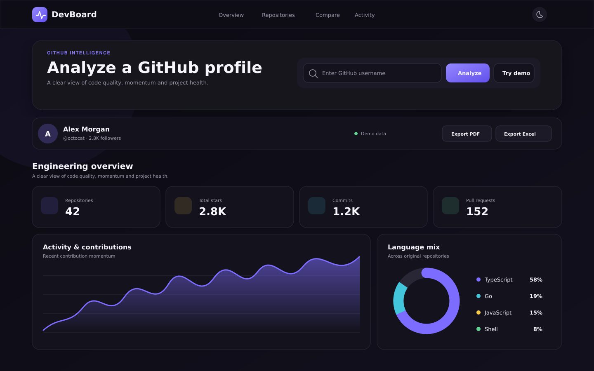

<div align="center">
  <h1>DevBoard</h1>
  <p><strong>GitHub intelligence that turns repository signals into clear engineering decisions.</strong></p>
  <p>
    <a href="https://github.com/javad-hasani/DevBoard/actions/workflows/ci.yml"></a>
    
    
    
  </p>
</div>



<details>
  <summary>View the full-resolution dashboard preview</summary>
  <br />
  
</details>

## Why DevBoard

DevBoard analyzes a public GitHub profile without requiring registration. It combines repository metadata with meaningful quality signals, surfaces improvement opportunities, and presents the result in a responsive bilingual dashboard.

## Features

- Profile, repository, language, commit and pull request analytics
- Explainable project quality score based on README, tests, license, CI and maintenance
- Personalized improvement suggestions for every repository
- Activity and contribution visualizations powered by Recharts
- Side-by-side repository comparison
- Persian and English interface with automatic RTL support
- Light and dark themes across desktop and mobile
- One-click PDF and Excel report export
- Built-in demo data when the GitHub API is unavailable
- Input validation, rate-friendly caching and optional authenticated API access

## Architecture

```text
src/
├── domain/          Business models and deterministic scoring
├── application/     Use cases and request validation
├── infrastructure/  GitHub API adapter and demo data
├── app/             Next.js pages and API routes
├── components/      Dashboard, charts and UI primitives
├── i18n/            Typed bilingual dictionaries
└── lib/             Reporting and shared utilities
```

Dependencies point inward: the domain layer has no framework dependency, application services orchestrate the domain, infrastructure isolates external APIs, and Next.js routes expose the use cases.

## Quick start

```bash
git clone https://github.com/javad-hasani/DevBoard.git
cd DevBoard
npm install
cp .env.example .env.local
npm run dev
```

Open [http://localhost:3000](http://localhost:3000). A GitHub token is optional, but recommended for a higher API rate limit.

```env
GITHUB_TOKEN=your_fine_grained_token
NEXT_PUBLIC_APP_URL=http://localhost:3000
```

## Quality checks

```bash
npm run typecheck
npm run lint
npm test
npm run build
npx playwright install chromium
npm run test:e2e
```

## Scoring model

| Signal | Weight |
|---|---:|
| README | 25 |
| Automated tests | 25 |
| License | 15 |
| GitHub Actions | 15 |
| Recent maintenance | 20 |

The score is intentionally transparent and deterministic. It is an engineering health indicator, not a judgment of code correctness.

## Deployment

Import the repository into Vercel, optionally set `GITHUB_TOKEN`, and deploy. The included configuration uses the standard Next.js build pipeline.

## Contributing

Issues and pull requests are welcome. Use the supplied templates and make sure the complete quality suite passes before opening a pull request.

## License

Released under the [MIT License](LICENSE).
